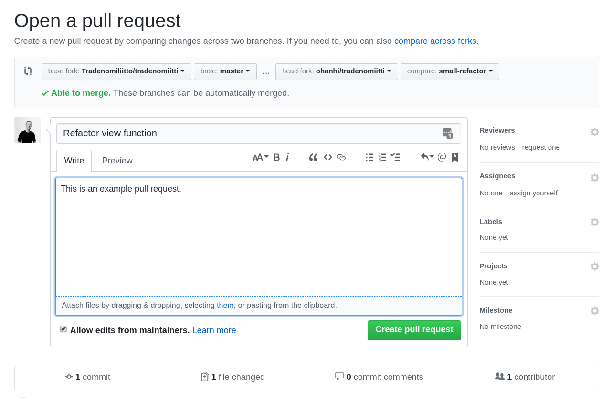

# Contributing to Tradenomiitti

You will likely want to do some customization to the look and feel of Tradenomiitti to make it your own. This guide tells you how to make contributing upstream straightforward, despite the look and feel changes you've made.


## Step 1. Make your customization commits separately

If you are looking to contribute back to the main repository, always make distinct commits when dealing with things that you don't want to include in your pull request.

Example:
```sh
$ git log --oneline
3eb42a9 Update logo
9cf7d28 Change colors
6a956fa #... (upstream)
```


## Step 2. Create a branch for your contribution

```sh
$ git checkout -b small-refactor
```

Now make your changes and commit them. Your history should look something like this:

```sh
$ git log --oneline
d24b41a Refactor view function
3eb42a9 Update logo
9cf7d28 Change colors
6a956fa #... (upstream)
```

## Step 3. Choose the commits

If you now open a pull request to the main repository, it will also include the color and logo changes. To contribute only the refactor, you can now rebase your branch to the latest upstream commit (`6a956fa` in this example).

```sh
$ git rebase -i
```

This will open a text editor. Now replace `pick` with `drop` in front of all the commits that you don't want in the PR:

```plaintext
pick d24b41a Refactor view function
drop 3eb42a9 Update logo
drop 9cf7d28 Change colors
```

## Step 4. Open the pull request

If you had already pushed the branch to your remote, you need to do a `git push --force` to overwrite the history in that branch. Otherwise just push the branch as a new branch.

On the GitHub website, you can now open a pull request from your fork and branch to the upstream master branch:




## Done!
